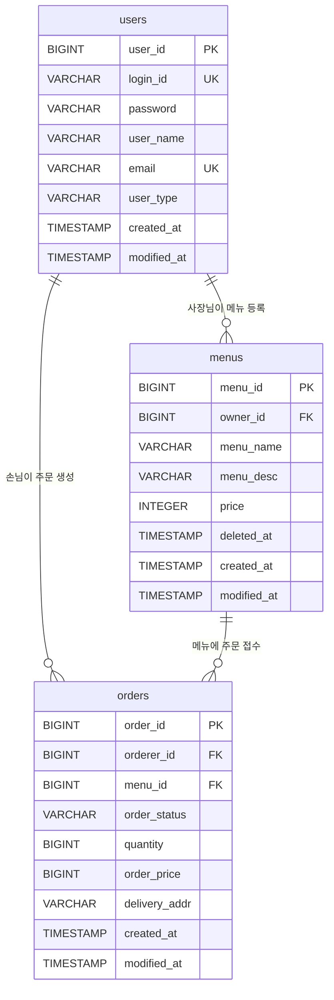
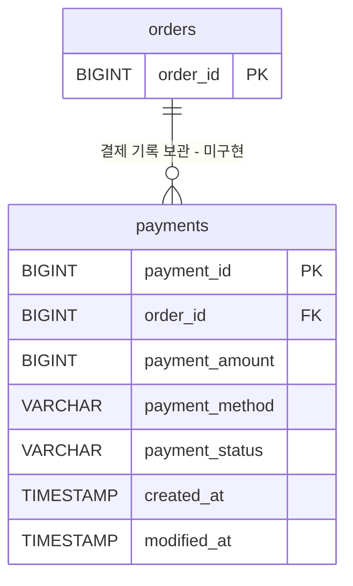

# 4-1. ERD

[문서 목록](./README.md) · [테이블 명세서](./4-2-table-spec.md)

기준: 2026-10-08 수정 후 엔티티 매핑. 실제 API 검증 범위는 [기능별 구현·검증 상태](./README.md#기능별-구현검증-범위)를 따른다. 결제 관계는 아래에 미구현 설계안으로 분리했다.

## 현재 구현된 관계

현재 엔티티는 `User`, `Menu`, `Order` 세 개다. 다음 그림의 컬럼 이름은 PostgreSQL에 매핑되는 이름을 기준으로 한다. `PK`는 기본키, `FK`는 외래키, `UK`는 단일 컬럼 유일 제약이다.

`||`는 정확히 한 개, `o{`는 0개 이상을 뜻한다. 회원은 메뉴나 주문을 아직 하나도 갖지 않을 수 있지만, 메뉴와 주문은 각각 연결 대상이 반드시 존재해야 한다.

| 자식 → 부모 | 외래키 | 관계 / JPA 설정 | 현재 구현 |
|---|---|---|---|
| 메뉴 → 사장님 | `menus.owner_id → users.user_id` | N:1 / `@ManyToOne(fetch = LAZY, optional = false)` | 있음 |
| 주문 → 주문자 | `orders.orderer_id → users.user_id` | N:1 / `@ManyToOne(fetch = LAZY, optional = false)` | 있음 |
| 주문 → 메뉴 | `orders.menu_id → menus.menu_id` | N:1 / `@ManyToOne(fetch = LAZY, optional = false)` | 있음 |
| 결제 → 주문 | 아래 설계안의 `payments.order_id` | 과제 요구: N:1 / `@ManyToOne(fetch = LAZY)` | **미구현** |

현재 세 관계는 모두 자식이 외래키를 갖는 단방향 관계다. 부모 엔티티에는 자식 컬렉션을 두지 않았으며, 양방향 매핑이나 연쇄 삭제는 설정하지 않았다.

## 관계에 연결되는 규칙

- `OWNER`와 `CUSTOMER`는 별도 테이블이 아니라 `users.user_type`으로 구분한다. 역할 조건은 FK만으로 보장되지 않으며 서비스 로직에서 판단한다.
- `menus`에는 `(owner_id, menu_name)` 복합 UNIQUE 제약이 있다. 서로 다른 사장님은 같은 메뉴명을 사용할 수 있다. 현재 제약과 중복 조회는 삭제된 메뉴도 포함한다.
- 메뉴 삭제는 행을 지우지 않고 `deleted_at`을 채운다. 메뉴 행과 FK가 남으므로 기존 주문 기록도 유지된다.
- 주문 한 건은 메뉴 한 개를 참조한다. `order_price`는 생성 시 `메뉴 가격 × quantity`로 계산해 저장하므로 이후 메뉴 가격 변경으로 다시 계산되지 않는다.
- 현재 주문에는 메뉴명·단가 스냅샷 컬럼이 없다. 저장되는 주문 금액은 총액이다.
- 공통 부모 `BaseEntity`의 `createdAt`, `modifiedAt`은 각 테이블에 포함된다. `BaseEntity` 자체의 테이블은 없다.

현재 `Order`의 주문자 Java 필드명은 `odererId`이지만, `@JoinColumn`에 지정한 DB 컬럼명은 `orderer_id`다. ERD는 DB 이름을 사용했다.

## 미구현 결제 관계 설계안

아래 그림은 현재 스키마에 추가할 관계를 보여준다. `payments`는 아직 구현되지 않았다. 나머지 현재 컬럼은 위 ERD를 따른다.

과제에 따라 주문 하나에 결제 기록 여러 개를 연결할 수 있도록 N:1로 설계한다. `payments.order_id` 전체에 UNIQUE를 걸어 1:1로 만들지는 않는다. 기본 기능에서는 `ORDERED` 주문만 결제하고, 성공 시 결제 기록 저장과 주문의 `PAID` 전환을 한 트랜잭션으로 처리해야 한다. 중복 성공 방지 방안은 [결제 테이블 설계안](./4-2-table-spec.md#미구현-payments-설계안)에 정리했다.

## 소스 근거

- [User.java](../src/main/java/com/example/delivery/entity/User.java)
- [Menu.java](../src/main/java/com/example/delivery/entity/Menu.java)
- [Order.java](../src/main/java/com/example/delivery/entity/Order.java)
- [BaseEntity.java](../src/main/java/com/example/delivery/entity/BaseEntity.java)
