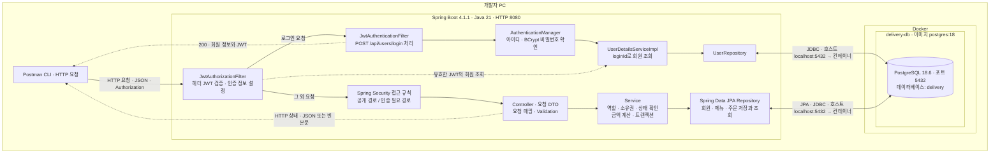
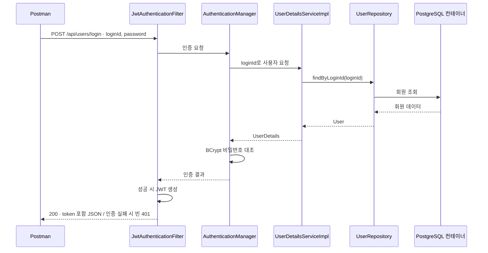

# 4-4. 인프라 설계도

[문서 목록](./README.md) · [API 명세서](./4-3-api-spec.md)

기준: 2026-10-08 소스와 실제 PostgreSQL/Postman 실행 환경. [전체 실행](./5-1-test-report.md)과 [부분 재검증](./5-1-fix-retest-report.md)에서 로컬 API와 Docker DB 연결을 확인했다.

## 로컬 PC 기준 구성

과제는 배포 없이 로컬에서 확인하는 백엔드 API다. 아래 그림은 현재 소스와 실제 테스트 구성을 반영한다. Spring Boot는 개발자 PC의 JVM에서, PostgreSQL은 Docker의 `delivery-db` 컨테이너에서 실행했다.

실선은 주요 요청·DB 접근, 점선은 보조 조회와 클라이언트 응답을 나타낸다. `UserRepository`는 Repository 계층의 구성원이며 인증 흐름을 설명하기 위해 따로 그렸다. 조회 결과는 호출한 계층으로 돌아온다.

## 구성 요소와 역할

| 요소 | 현재 프로젝트에서의 역할 |
|---|---|
| Postman CLI | 회원가입·로그인·메뉴·주문 API 요청, 상태 코드와 JSON assertion 검증 |
| Spring Boot 애플리케이션 | 하나의 JVM 프로세스에서 API와 인증 처리. 별도 프론트엔드 없음 |
| JwtAuthorizationFilter | Authorization 헤더에서 JWT를 읽고 검증한 뒤 인증 정보를 구성 |
| JwtAuthenticationFilter | 로그인 요청을 직접 처리하고 성공 시 토큰 JSON 응답 작성 |
| AuthenticationManager / UserDetailsServiceImpl | 로그인 인증과 DB 회원 조회 |
| Controller / DTO | HTTP 매핑, 요청 바인딩·검증, 필요한 필드만 응답 |
| Service | 역할·소유권·주문 상태 판단, 트랜잭션, 주문 금액 계산 |
| Repository / JPA | Query Methods와 엔티티 매핑으로 DB 접근 |
| Docker | PostgreSQL 컨테이너 실행, 호스트의 DB 접속 포트를 컨테이너로 연결 |
| PostgreSQL 컨테이너 | delivery DB에 회원·메뉴·주문 데이터 저장. 결제 엔티티는 미구현 |

현재 패키지는 `controller`, `service`, `repository`, `entity`, `dto`, `config`, `jwt`, `security`로 나뉜다. 3 Layer를 사용하며, 과제에 제시된 도메인 우선 패키지 구조와는 배치가 다르다.

## 포트와 설정

| 항목 | 확인한 값 / 기준 |
|---|---|
| 애플리케이션 이름 | delivery |
| Java | build.gradle toolchain: 21 |
| Spring Boot | build.gradle: 4.1.1 |
| 빌드 | Gradle, Groovy DSL |
| API 호출 주소 | `http://localhost:8080` — 실제 테스트에서 호출한 주소 |
| DB URL | `jdbc:postgresql://localhost:5432/delivery` |
| DB 실행 방식 | Docker 컨테이너 `delivery-db`, 이미지 `postgres:18` |
| DB 호스트 포트 → 컨테이너 포트 / DB 이름 | 5432 → 5432 / delivery |
| PostgreSQL 버전 | 실제 실행 버전 18.6. 최초 SQL 조회와 수정 후 서버 연결에서 확인 |
| JPA DDL | `ddl-auto: update` |
| SQL 출력 | `show-sql: true`, `format_sql: true` |
| 세션 정책 | STATELESS |
| 인증 전달 | Authorization 요청 헤더. 현재 로그인은 쿠키를 발급하지 않음 |
| JWT | HS256, 60분 만료. 비밀키는 설정에서 읽음 |

DB 인증 정보와 JWT 비밀키 값은 문서에 복사하지 않았다. 실행 환경에서는 각각 datasource 설정과 `jwt.secret.key`가 필요하다.

Spring Boot는 `localhost:5432`로 접속하고, Docker가 공개한 호스트 포트를 통해 컨테이너의 5432 포트에 연결한다. 컨테이너 이름·이미지·포트는 테스트 당시 구성이다. 볼륨·백업 설정은 이번 검증에서 확인하지 않았으므로 다이어그램에 특정 구성을 가정하지 않았다.

Spring Boot를 PC에서 실행하므로 DB URL의 localhost는 개발자 PC를 가리킨다. 애플리케이션까지 컨테이너로 옮기면 localhost의 의미가 달라지므로 DB 접속 주소도 함께 변경해야 한다.

## 요청이 처리되는 방식

### 1. 회원가입

`POST /api/users/registry`는 인증 없이 접근한다. `UserController`가 요청 DTO를 검증하고, `UserService`가 중복 아이디·이메일을 확인한 후 비밀번호를 BCrypt로 해시한다. `UserRepository`가 회원을 저장하고 비밀번호를 제외한 DTO를 반환한다. 성공 코드는 201이다.

### 2. 로그인

로그인은 일반 Controller를 거치지 않는다.

### 3. 인증된 메뉴·주문 요청

클라이언트가 JWT를 헤더로 보낸다. `JwtAuthorizationFilter`는 서명·만료 시간을 확인하고 `UserDetailsServiceImpl`을 통해 회원을 조회해 SecurityContext를 만든다. 즉, STATELESS라고 해서 현재 구현이 인증 과정에서 DB를 조회하지 않는 것은 아니다.

이후 Controller → Service → Repository 순서로 처리한다. 현재 OWNER/CUSTOMER 및 소유권 검사는 주로 Service가 맡는다. 예를 들어 메뉴 수정은 OWNER인지와 본인 메뉴인지를 모두 검사한다. 주문 취소는 본인 주문 검사만 있고 별도 CUSTOMER 역할 검사는 없다.

조회는 JSON으로 응답하고, 메뉴 삭제·주문 취소·주문 상태 변경은 본문 없는 204로 응답한다. DB의 생성·수정 시각은 JPA Auditing으로 관리한다.

### 4. 공개 메뉴 조회

`GET /api/menus/`와 `GET /api/menus/{menuId}`는 토큰 없이 호출할 수 있다. 요청은 보안 필터 체인을 통과하되 공개 경로로 허용된다. 메뉴 등록·수정·삭제에는 인증과 서비스의 역할·소유권 검사가 적용된다.

## 트랜잭션과 데이터 흐름

| 작업 | 현재 DB 변경 |
|---|---|
| 회원가입 | users INSERT |
| 메뉴 등록 | menus INSERT |
| 메뉴 수정 | menus의 이름·설명·가격 UPDATE |
| 메뉴 삭제 | menus.deleted_at UPDATE, 실제 DELETE 없음 |
| 주문 생성 | 입력 검증 후 orders INSERT, 서버 계산 총액 저장, 201과 orderId 반환 |
| 주문 취소 | orders.order_status = CANCELED |
| 주문 처리 | PAID → ACCEPTED → COMPLETED |
| 결제 | 미구현. 결제 저장과 ORDERED → PAID 전환 흐름 없음 |

## 구현 상태에 따른 제한

- 회원·메뉴·주문 생성은 수정 후 재검증했다. 결제가 미구현이므로 정상 API 흐름으로 PAID와 이후 배달 완료 단계까지 진행할 수 없다.
- JWT 검증 실패 시 오류 응답을 쓰지 않고 종료하는 경로가 있다. 그림의 인증 단계가 모든 실패에 401을 반환한다는 뜻은 아니다.
- 오류 디스패치는 현재 보안 설정에서 허용되어 있지만 공통 오류 DTO는 없다.
- 메뉴 Soft Delete는 목록·새 주문 생성뿐 아니라 단건 조회·수정·재삭제에도 적용된다. 기존 주문은 보존한다.
- 원격 서버·리버스 프록시·로드밸런서·Redis·메시지 큐·외부 PG는 현재 구성에 없다. 현재 과제 범위에서 별도로 추가하지 않았다.

## 소스 근거

- [build.gradle](../build.gradle), [application.yml](../src/main/resources/application.yml)
- [DeliveryApplication.java](../src/main/java/com/example/delivery/DeliveryApplication.java)
- [WebSecurityConfig.java](../src/main/java/com/example/delivery/config/WebSecurityConfig.java)
- [JWT 필터와 유틸리티](../src/main/java/com/example/delivery/jwt)
- [UserDetailsServiceImpl.java](../src/main/java/com/example/delivery/security/UserDetailsServiceImpl.java)
- [서비스 계층](../src/main/java/com/example/delivery/service), [Repository 계층](../src/main/java/com/example/delivery/repository)
